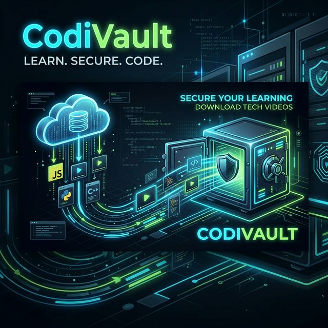
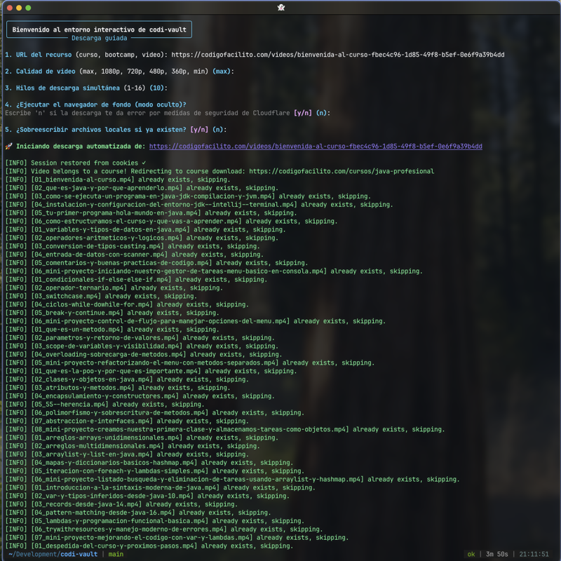

<!-- markdownlint-disable MD033 MD036 MD041 MD045 MD046 -->
<div align="center">
    
</div>
<div align="center">

<h1 style="border-bottom: none">
    <b>codi-vault — Codigo Facilito Downloader</b>
</h1>

Descarga automatizada de los cursos de **_`Codigo Facilito`_**<br />
con un script creado con **_`Python`_**, **_`Playwright`_** y **_`FFmpeg`_**.


[](https://opensource.org/licenses/MIT)

</div>

---

## ¿Qué hace?

codi-vault te permite descargar todos los videos de un curso, bootcamp o video individual de [Código Facilito](https://codigofacilito.com/) para verlos **sin conexión a internet**.

El flujo es simple:
1. Iniciás sesión una sola vez con `facilito login` (se abre un navegador real)
2. La sesión se guarda localmente de forma automática
3. Pasás la URL del curso y el script descarga **todos los videos automáticamente**

---

## Requisitos del sistema

| Herramienta | Versión mínima | Cómo instalar |
|---|---|---|
| **Python** | 3.10+ (recomendado 3.12) | [python.org](https://www.python.org) o `brew install python@3.12` |
| **FFmpeg** | cualquiera | `brew install ffmpeg` (macOS) / `sudo apt install ffmpeg` (Linux) |

> [!IMPORTANT]
> **FFmpeg es requerido** para procesar y guardar los videos HLS. Es la herramienta que hace el trabajo pesado de descarga.

---

## Instalación rápida con `venv` + `requirements.txt` ⭐ Recomendado

Este es el método más simple. No requiere Poetry.

```console
# 1. Clonar el repositorio
git clone https://github.com/jdfesa/codi-vault.git
cd codi-vault

# 2. Crear y activar el entorno virtual
python3 -m venv venv
source venv/bin/activate       # macOS / Linux
# venv\Scripts\activate        # Windows

# 3. Instalar dependencias
pip install -r requirements.txt

# 4. Instalar el paquete en modo editable (para el comando `facilito`)
pip install -e .

# 5. Instalar el navegador Chromium
playwright install chromium

# 6. Instalar FFmpeg (si no lo tenés)
brew install ffmpeg             # macOS
# sudo apt install ffmpeg -y   # Ubuntu/Debian
```

Con el venv activo, el comando disponible es directamente:

```console
facilito --help
```

> [!TIP]
> Cada vez que abras una nueva terminal, recordá activar el entorno con `source venv/bin/activate` antes de usar el script.


---

## Instalación con Poetry (alternativa)

### 1. Instalar herramientas del sistema

```console
# Instalar pipx (gestor de herramientas Python aisladas)
brew install pipx

# Instalar Poetry via pipx
pipx install poetry
```


### 2. Instalar FFmpeg

```console
brew install ffmpeg
```

### 3. Clonar el repositorio

```console
git clone https://github.com/jdfesa/codi-vault.git
cd codi-vault
```

### 4. Configurar Python y dependencias

> [!IMPORTANT]
> Es fundamental indicarle a Poetry que use **Python 3.12** (o 3.10/3.11). La versión 3.14 no es compatible con algunas dependencias.

```console
# Apuntar Poetry a Python 3.12 del sistema
poetry env use /usr/local/bin/python3.12

# Instalar todas las dependencias del proyecto
poetry install
```

### 5. Instalar el navegador Chromium de Playwright

```console
poetry run playwright install chromium
```

---

## Instalación en Linux

```console
# Instalar FFmpeg
sudo apt install ffmpeg -y   # Ubuntu/Debian
sudo pacman -S ffmpeg        # Arch Linux

# Clonar e instalar
git clone https://github.com/jdfesa/codi-vault.git
cd codi-vault
pip install poetry
poetry install
poetry run playwright install chromium
```

---

## Actualización

```console
# Dentro del directorio del proyecto
git reset --hard HEAD
git pull
poetry install
poetry run playwright install chromium
```

---

## Guía de uso

### Login

Abrí un navegador real donde podés iniciar sesión con tu cuenta (Email, Google o Facebook):

```console
poetry run facilito login
```

Tenés **3 minutos** para completar el login. La sesión se guarda automáticamente en tu sistema y se reutiliza en descargas futuras.

> [!TIP]
> El login sólo hay que hacerlo una vez. La sesión persiste entre ejecuciones hasta que expire o hagas logout.

#### Login con cookies (método alternativo)

Si el método estándar falla (ej: captcha), podés exportar tus cookies desde el navegador:

1. Instalá la extensión [**GetCookies**](https://chromewebstore.google.com/detail/get-cookiestxt-locally/cclelndahbckbenkjhflpdbgdldlbecc) en Chrome
2. Iniciá sesión en Código Facilito desde Chrome
3. Exportá las cookies en formato JSON
4. Usá el siguiente comando:

```console
poetry run facilito set-cookies path/to/cookies.json
```

### Logout

```console
poetry run facilito logout
```

### Descarga Interactiva (Recomendado) ⭐

Si prefieres no usar el comando manual ni aprender parámetros, el proyecto incluye un asistente completamente guiado en terminal:

```console
poetry run facilito interactive
```

<div align="center">
    
</div>

El script te guiará de la mano para establecer:
1. La URL del recurso.
2. La calidad de descarga.
3. Opcionalmente configurar ocultar el navegador (`headless`). **Nota:** Si la consola arroja un error al obtener la información de un bootcamp (debido a las protecciones anti-bot automáticas del sitio), contesta 'n' a la ejecución de modo oculto para saltarte esa capa de seguridad exitosamente.

> [!TIP]
> **🚀 Auto-descarga Inteligente:** Si ingresas la URL de un **video individual** (terminada en `/videos/...`), el script detectará automáticamente si ese video pertenece a un curso más grande. Si es así, **codi-vault redirigirá la orden y comenzará a descargar el curso completo** para que no tengas que ir copiando enlaces uno por uno. Solo los videos legítimamente "sueltos" (como talleres o introducciones independientes) se descargarán como archivos individuales.

---

### Descarga Manual (Avanzado)

```console
poetry run facilito download <url> [OPCIONES]
```

**Opciones:**
- `--quality`, `-q`: calidad del video (`max` | `1080p` | `720p` | `480p` | `360p` | `min`). Por defecto: `max`
- `--override`, `-w`: sobreescribir archivos existentes. Por defecto: `False`
- `--threads`, `-t`: hilos paralelos de descarga (1–16). Por defecto: `10`

**Ejemplos:**

```console
# Descargar un curso completo
poetry run facilito download https://codigofacilito.com/cursos/docker

# Descargar un bootcamp completo
poetry run facilito download https://codigofacilito.com/programas/ingles-conversacional

# Descargar con calidad específica y menos hilos
poetry run facilito download https://codigofacilito.com/cursos/docker -q 720p -t 5

# Descargar un video individual
# (Nota: ¡Si el video pertenece a un curso completo, codi-vault bajará el curso entero por ti!)
poetry run facilito download https://codigofacilito.com/videos/...
```

> [!TIP]
> Si una descarga se interrumpe, volvé a ejecutar el mismo comando: los videos ya descargados se saltean automáticamente.

Los videos de cursos y programas se enlazan de forma deductiva y se organizan automáticamente en subcarpetas estructuradas. Únicamente los videos de índole verdaderamente solitaria (que fallan en encontrar un "curso madre") se guardan aislados en la carpeta `Facilito/Videos Sueltos/`.

---

## Cómo funciona internamente

```
facilito download <url>
       │
       ├── Playwright abre un navegador con las cookies de sesión guardadas
       ├── Navega al curso/bootcamp y extrae la estructura (secciones + unidades)
       ├── Para cada video: extrae la URL del stream HLS (.m3u8)
       └── FFmpeg descarga el stream HLS pasando las cookies de autenticación
           como headers HTTP → guarda como .mp4
```

**Tecnologías clave:**
- **Playwright** + **playwright-stealth**: automatización de navegador con anti-bot
- **FFmpeg**: descarga y conversión de streams HLS autenticados
- **Typer**: interfaz de línea de comandos
- **aiohttp** + **aiofiles**: descargas asíncronas

---

## Cambios recientes (vs versión original)

| Cambio | Descripción |
|---|---|
| 🔄 Descarga con **FFmpeg** | Se reemplazó `vsd` (que fallaba en macOS) por `ffmpeg` con soporte de cookies HTTP |
| 🔐 Detección de sesión | Ya no depende de un selector CSS frágil; ahora verifica las cookies de sesión directamente |
| ⏱️ Tiempo de login | De 2 a 3 minutos para completar el login |
| 🐍 Compatibilidad Python | Probado y funcional con Python 3.12 en macOS |
| 📊 Barra de progreso | Implementación visual interactiva con `rich` detallando tamaño, velocidad y tiempos |
| 🤖 Asistente interactivo | Nuevo comando `interactive` para configurar todas las descargas guiadas paso a paso |
| 🛡️ Extracción de Tokens | Bypass dinámico para enlaces premium protegidos (Asesorías/Bootcamps) que rebotaban en 403 |
| 🚀 Auto-descarga de Rutas | Al pasar un `.com/videos/...` particular, el script ubicará mágicamente el Curso padre y lo bajará entero sin intervención |
| 📂 Organización limpia | Organización estricta de videos individuales en su propio subdirectorio especializado |

---

## Solución de Problemas y Troubleshooting

Si encuentras fallas repentinas, bloqueos por *Cloudflare* (pantallas de "Just a moment...") o errores esporádicos al intentar decodificar los cursos:

👉 **[Consulta la Guía de Solución de Problemas](./TROUBLESHOOTING.md)** para encontrar explicaciones y el marco general de las soluciones documentadas que hemos implementado a causas comunes.

---

## TODO

¡Contribuciones son bienvenidas!

- [ ] Manejo de reintentos automáticos de conexión
- [ ] Incorporación de tests automatizados

---

# **Aviso de uso**

Este proyecto se realiza con fines exclusivamente educativos y de aprendizaje. El código se ofrece "tal cual" sin ninguna garantía.

No me hago responsable por cualquier mal uso.
Es responsabilidad del usuario utilizarlo dentro de los límites legales y éticos.
